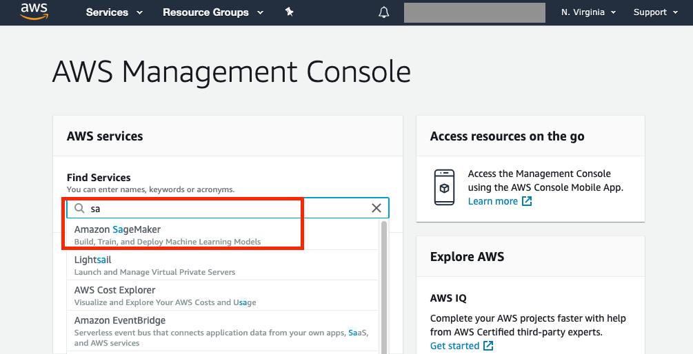
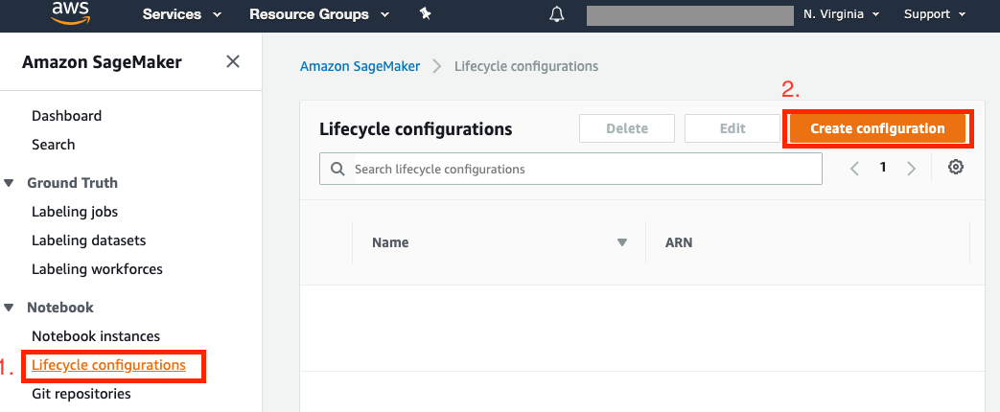
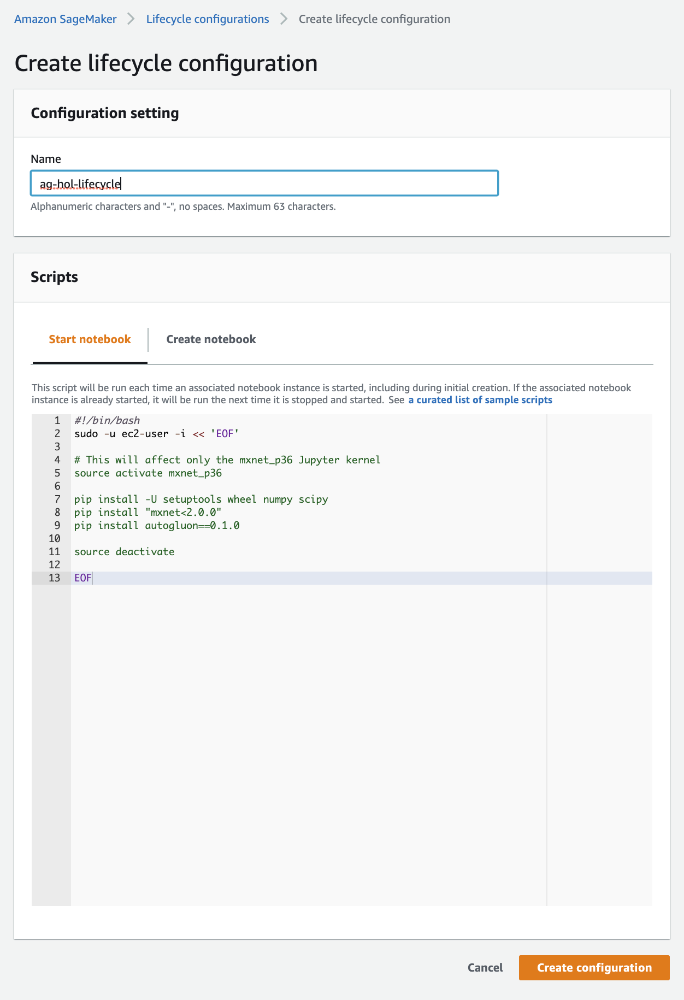
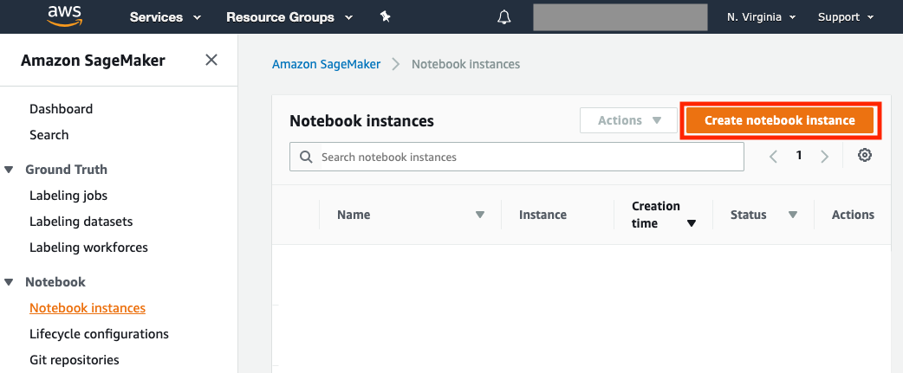
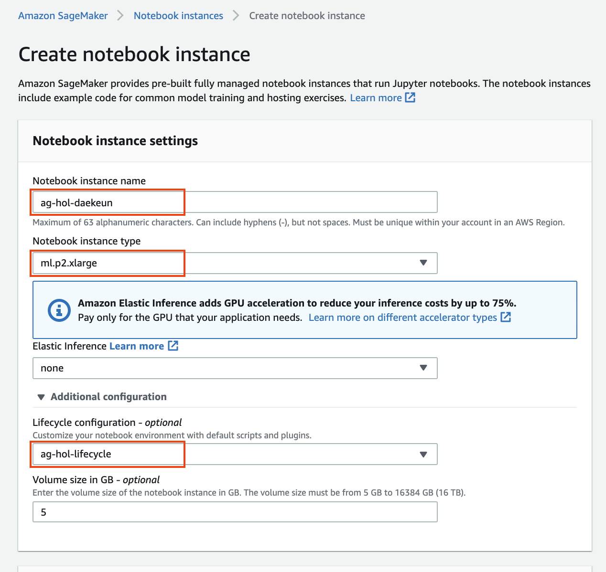
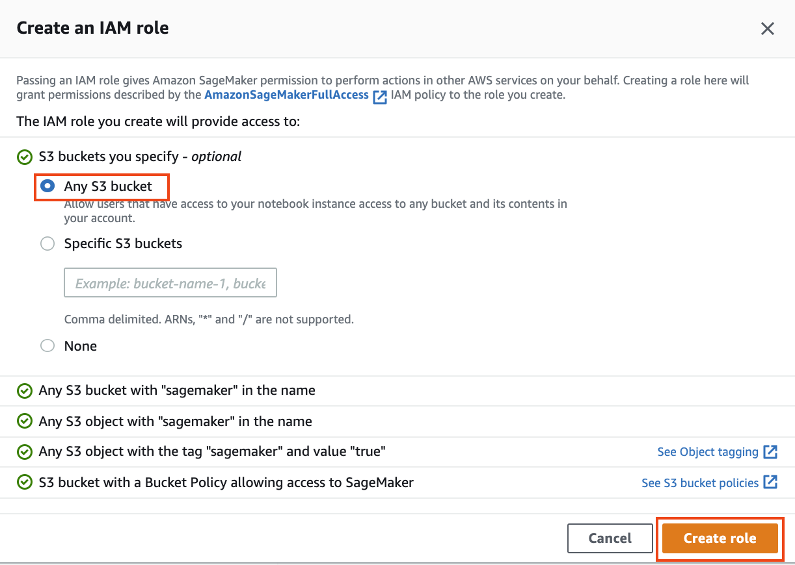

# Setup
본 핸즈온을 수행하기 위해서는 수동 환경 설정(Option 1)이나 AWS CloudFormation 설정(Option 2)이 필요합니다.

 

## Option 1. 수동 환경 설정

### Lifecycle Configuration 생성
1. AWS 관리 콘솔에서 오른쪽 상단에서 Region 선택 후 AWS Services 리스트에서 Amazon SageMaker 서비스를 선택합니다.
    

1. Lifecycle Configuration를 생성하기 위해 왼쪽 패널 메뉴 중 `Lifecycle configurations` 을 선택 후, 오른쪽 상단의 `Create configuration` 버튼을 클릭 합니다.
    

1. Name 항목에 `ag-hol-lifecycle`을 입력하고 <a href="TODO" download target="_blank">Lifecycle Configuration Script</a>를 클릭하여 다운로드합니다. 
다운로드가 완료되었으면 `ag-hol-lifecycle.sh`의 내용을 복사하여 Script 항목에 붙여넣기한 후, 오른쪽 하단의 `Create configuration` 버튼을 클릭합니다. 
    

### Notebook instance 생성

1. 새로운 Notebook instance를 생성하기 위해 왼쪽 패널 메뉴 중 Notebook Instances 선택 후 오른쪽 상단의 `Create notebook instance` 버튼을 클릭 합니다.
    

1. Notebook instance 이름으로 `ag-hol-[YOUR-NAME]` 으로 넣은 뒤 `ml.p2.xlarge` 인스턴스 타입을 선택합니다. 그런 다음, Additional configuration을 클릭하여 Lifecycle configuration - optional 항목에 `ag-hol-lifecycle`을 입력합니다.
    

1. IAM role은 `Create a new role` 을 선택하고, 생성된 팝업 창에서는 `S3 buckets you specify – optional` 밑에 `Any S3 bucket` 을 선택합니다. 그 이후 `Create role` 을 클릭합니다.
    

1. 다시 Create Notebook instance 페이지로 돌아온 뒤 `Create notebook instance` 를 클릭합니다.

### Notebook Instance 접근하기

1. 서버 상태가 `InService` 로 바뀔 때까지 기다립니다. 보통 5분 정도의 시간이 소요 됩니다. 

1. (Optional) 노트북 인스턴스가 생성되는 동안 Lifecycle configuration이 정상적으로 동작하는지 CloudWatch로 확인해 봅니다. 이 과정은 필수가 아니기에 선택적으로 수행하시면 됩니다.

1. `Open Jupyter`나 ``Open JupyterLab`을 클릭하여 방금 생성한 notebook instance의 개발 환경으로 접속합니다.

 

## Option 2. AWS CloudFormation 환경 설정
TODO

수고하셨습니다. 