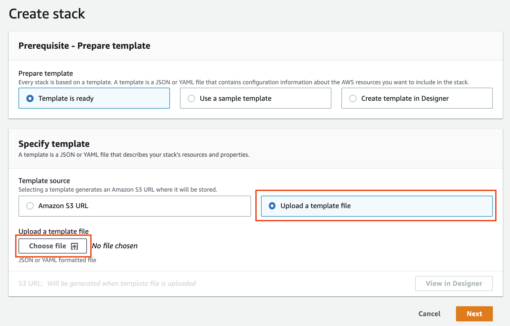
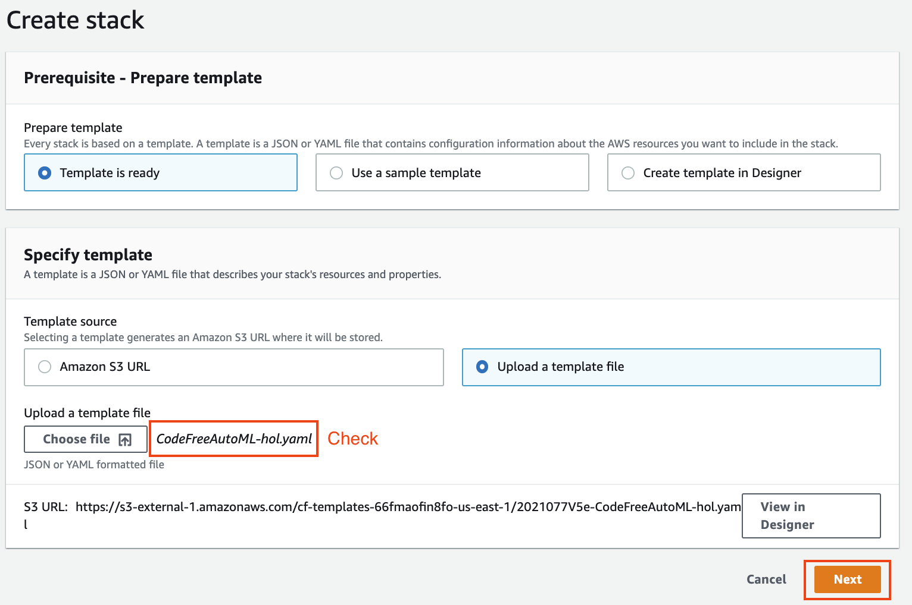
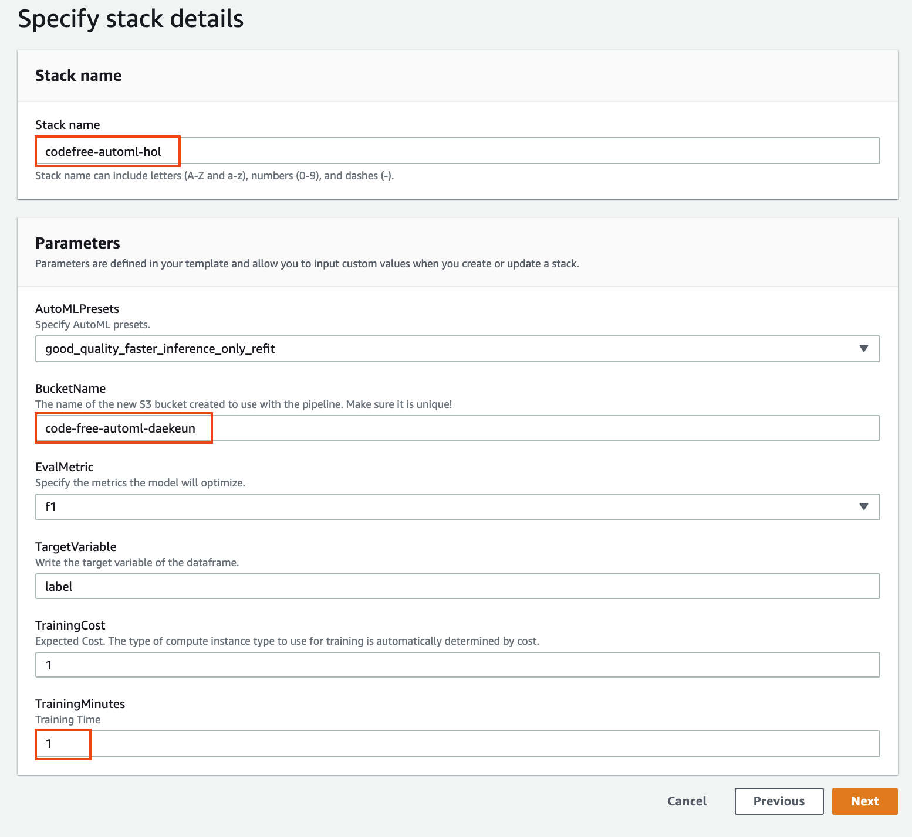
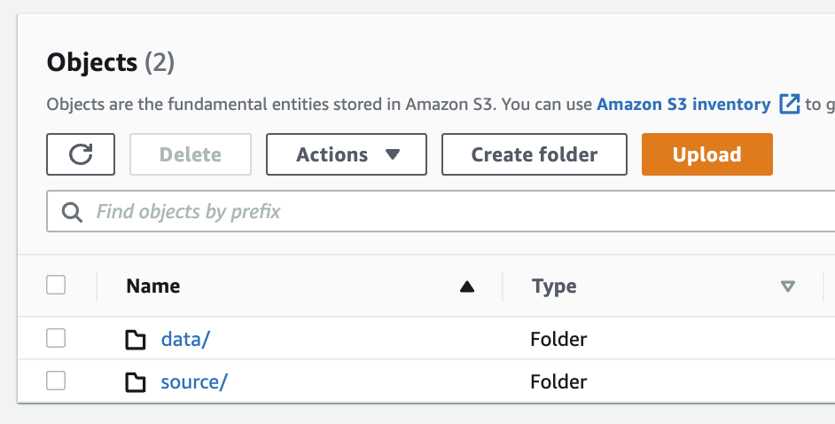
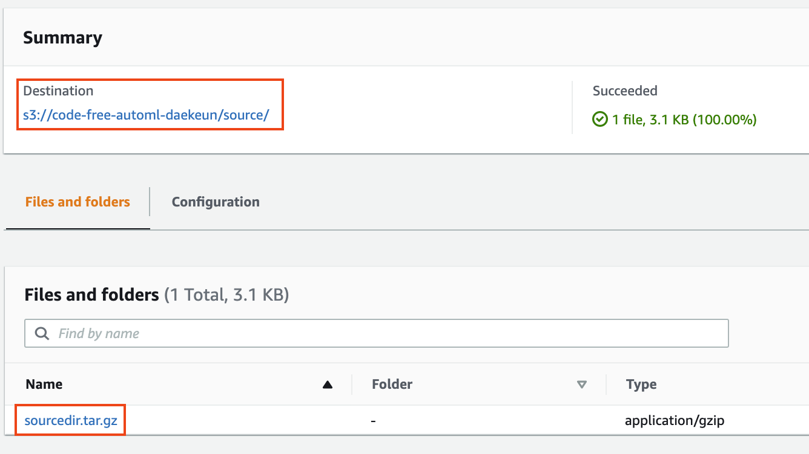
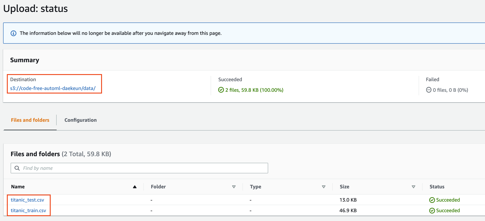
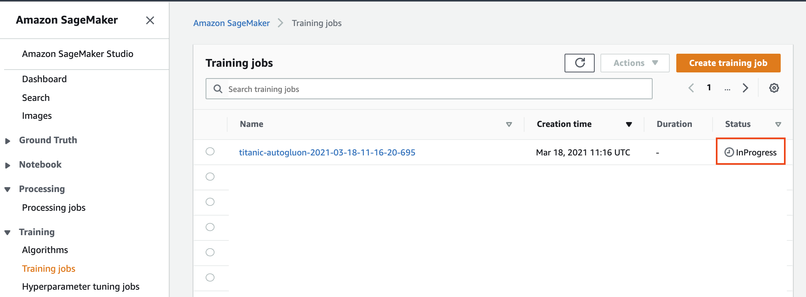
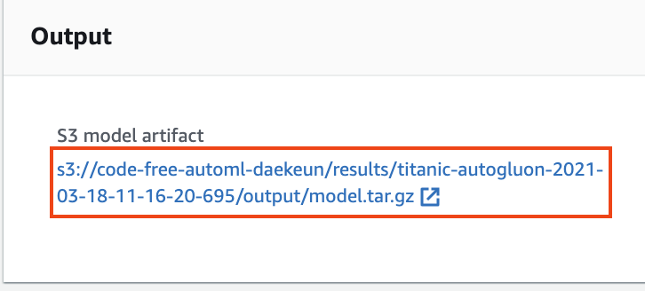
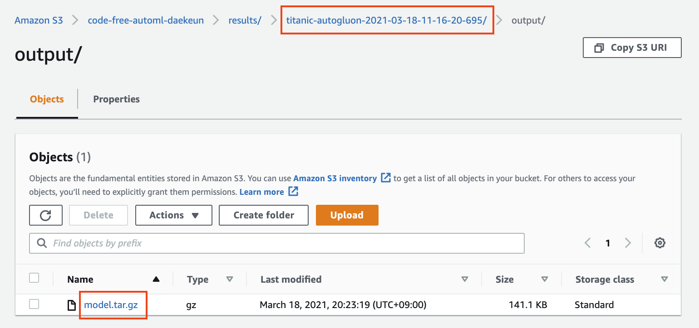
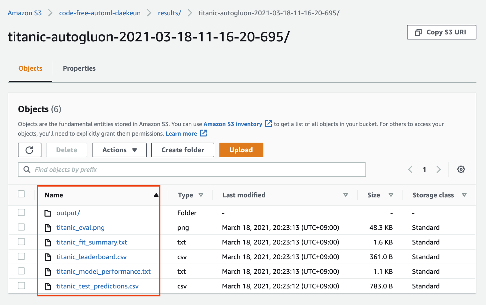

# AutoML with AutoGluon, Amazon SageMaker, and AWS Lambda
본 핸즈온은 약 30-40분이 소요됩니다.

## Code
- `autogluon-tab-with-test.py`: 훈련 데이터를 Amazon S3에 업로드할 때 AWS Lambda 함수가 자동으로 시작되는 SageMaker Training job에 의해 실행되는 스크립트로, 파이프라인 사용을 위해 `sourcedir.tar.gz`에 미리 패키징되어 있습니다. 이 스크립트를 수정하여 자체 모델 훈련 코드로 파이프라인을 재사용할 수 있습니다.
- `CodeFreeAutoML-hol.yaml`은 파이프라인을 배포하는 데 사용하는 AWS CloudFormation 템플릿입니다.
- `lambda_function.py`: 데이터를 Amazon S3에 업로드할 때 Amazon SageMaker 훈련 작업을 시작하는 AWS Lambda 함수의 소스 코드입니다.
- `sourcedir.tar.gz`: 사용자의 편의를 위해 미리 패키지된 `autogluon-tab-with-test.py` 파일입니다.
- `inference_on_local.ipynb`: Amazon S3에서 훈련된 모델을 복사하고 로컬에서 추론 및 평가를 수행하는 예제 코드입니다.

## Overview
Code-free AutoML 파이프라인은 AutoGluon이 모델을 빌드하는 데 사용하는 훈련 데이터, 예측하려는 테스트 데이터, AutoGluon을 설정하는 스크립트가 포함된 패키지를 Amazon S3 버킷으로 업로드하는 과정부터 시작합니다. Amazon S3에 데이터를 업로드하면 Lambda 함수가 훈련 데이터에 대해 미리 만들어진 AutoGluon 스크립트를 실행하는 Amazon SageMaker 모델 훈련 작업을 시작합니다. 훈련 작업이 완료되면 AutoGluon의 최고 성능 모델이 테스트 데이터에 대한 예측을 수행하고 이러한 예측은 동일한 S3 버킷에 다시 저장됩니다. 

## Step 1. AWS CloudFormation을 사용하여 파이프라인 배포
----

1. AWS CloudFormation에 접속합니다.
1. `Create stack` 버튼을 클릭합니다.
1. **Specify template** 화면의 Template source 항목에서 `Upload a template file`을 선택하고 Upload a template file 항목에서 `Choose file` 버튼을 클릭하여 `CodeFreeAutoML-hol.yaml` 파일을 업로드합니다. (Figure 1. 참조)

**
Figure 1. Create stack
** 

1. `CodeFreeAutoML-hol.yaml`이 정상적으로 업로드되었다면, 하단 우측의 `Next` 버튼을 클릭합니다.

**
Figure 2. Create stack
** 

1. **Stack name** 에 적절한 스택명을 입력합니다 (예: code-free-automl-stack)
1. **BucketName** 에 S3 버킷의 고유한 이름을 입력합니다 (예 : code-free-automl-yournamehere
1. **TrainingMinutes** 에 1을 입력합니다. TrainingMinutes와 TrainingCost에 따라 훈련 컴퓨팅 인스턴스가 자동으로 결정됩니다. (단, 본 핸즈온은 편의를 위해 컴퓨팅 인스턴스가 고정됩니다.)
1. (Optional) **TargetVariable** 에 정답 레이블의 컬럼명을 입력합니다. 고정값은 label이며, 이 컬럼명이 훈련 데이터셋에 포함되어야 합니다.

**
Figure 3. Specify stack details
** 

1. IAM 생성 승인 확인란(I acknowlege that AWS CloudFormation might create IAM resources with custom names.)을 선택하고 하단 우측의 `Create stack` 버튼을 클릭합니다 .

**
Figure 4. IAM 생성 승인 확인
** 

- AWS CloudFormation이 ML 파이프라인에 필요한 리소스를 생성하는 데 잠시 시간이 걸립니다. `CREATE_IN_PROGRESS` 에서
`CREATE_COMPLETE` 로 상태가 변경되면 (페이지를 새로 고쳐야 할 수 있습니다) ML 파이프라인 환경이 자동으로 설정됩니다.

**
Figure 5. CloudFormation 생성 중
** 

## Step 2. Event Driven Code-free AutoML
----

### S3 설정

1. Amazon S3로 접속 후 S3 버킷이 정상적으로 생성되었는지 확인합니다.

1. 생성된 S3 버킷에서 `data` 폴더와 `source` 폴더를 생성합니다.

**
Figure 6. 폴더 생성
** 

1. S3 버킷의 `source` 폴더에 `sourcedir.tar.gz` 패키지를 업로드합니다. 이제 Code-free ML 파이프라인을 사용할 준비가 되었습니다.

**
Figure 7. sourceir.tar.gz 업로드
** 

### 훈련 데이터 준비
1. S3 버킷의 `data` 폴더에 여러분의 훈련 데이터와 테스트 데이터를 업로드합니다. 파이프라인은 실제 애플리케이션에서 가장 일반적인 데이터 형식 인 테이블 형식(tabular) 데이터에 대한 이진 분류(binary classification) 예측을 수행하도록 설계되었습니다. 파일명은
`[YOUR-NAME]_train.csv`, `[YOUR-NAME]_test.csv` 어야 하며, [YOUR-NAME]은 여러분이 원하는 문자열로 변경해 주세요.
(예: `titanic_train.csv`, `titanic_test.csv`) 

**
Figure 8. [YOUR-NAME]_train.csv, [YOUR-NAME]_test.csv 업로드
** 

### 모델 훈련 및 추론 수행
1. 훈련 및 테스트 데이터 세트 파일이 Amazon S3에 업로드되면 AWS는 이벤트 발생을 기록하고 Lambda 함수를 자동으로 트리거합니다. 이 함수는 AutoGluon을 사용하여 ML 모델 앙상블을 훈련하는 Amazon SageMaker 훈련 작업(Training job)을 시작합니다. Amazon SageMaker 콘솔의 `Training jobs` 섹션에서 훈련 상태를 확인할 수 있습니다 (다음 스크린 샷 참조).

**
Figure 9. Amazon SageMaker Training job
** 

1. 수 분 후(약 7-8분 후), 훈련 작업이 완료되면 training job Name 항목의 링크를 클릭합니다.

**
Figure 10. Select Training job
** 

1. 훈련 내역을 스크롤한 다음 

**
Figure 11. Select Training job
** 

1. `Training job 폴더/output` 폴더에서 훈련이 완료된 모델 아티팩트를 확인할 수 있습니다. 이제 Figure 상단의 상위 폴더로 접속합니다.

**
Figure 12. model.tar.gz
** 

1. 상위 폴더에서 AutoGluon의 훈련 결과 및 평가 결과를 확인할 수 있습니다. 이 파일들은 Amazon S3 콘솔에서 로컬 시스템으로 다운로드할 수 있습니다.

**
Figure 13. model.tar.gz
** 
    - `[YOUR-NAME]_eval.png`: AUROC, AUPRC, Confusion matrix 확인
    - `[YOUR-NAME]_fit_summary.txt`: 모델 훈련 결과 요약
    - `[YOUR-NAME]_leaderboard.csv`: AutoGluon에 의해 훈련된 각 개별 모델의 순위 및 예측 성능
    - `[YOUR-NAME]_model_performance.txt`: 최고 성능 모델에 해당하는 metric
    - `[YOUR-NAME]_test_prediction.csv`: 테스트셋의 예측 결과 저장

1. `[YOUR-NAME]_eval.png`을 로컬로 다운로드 후, AUROC(Area Under Receiver Operating Characteristic), AUPRC(Area Under Precision-Recall Curve), Confusion matrix을 확인해 봅니다.

**
Figure 14. [YOUR-NAME]_eval.png
** 

- 훈련된 모델을 Amazon SageMaker 호스팅 엔드포인트로 배포하여 실시간으로 신규 데이터를 예측하거나 Amazon SageMaker 배치 변환 작업을 실행하여 추가 테스트 데이터 파일에 대한 예측을 수행하여 이 솔루션을 확장할 수 있습니다. 또한, model.tar.gz를 다운로드해서 로컬 시스템에서 추론을 수행하는 것도 가능합니다.

- (Optional) `sourcedir.tar.gz` 패키지의 압축을 풀고 내부의 Python 스크립트를 보면  AutoGluon이 실행되는 것을 알 수 있습니다. 여기에서 정의된 일부 파라메터를 조정해 보세요.

### Cleanup
파이프라인은 온디맨드로 완전 관리형 컴퓨팅 리소스만 사용하기 때문에 더 이상 비용이 들지 않습니다. 하지만, 불필요한 과금을 위해 핸즈온 시에는 Amazon S3 버킷의 모든 파일들을 삭제하고 AWS CloudFormation 스택을 삭제하는 것을 추천드립니다. 이 때, AWS CloudFormation은 내부 파일이있는 S3 버킷을 자동으로 삭제하지 않기 때문에, S3 버킷을 반드시 모두 비워 주세요.

이상으로 본 모듈의 실습 과정을 마무리 하셨습니다. 워크샵 이후 발생되는
비용을 방지하기 위해 서비스 종료 가이드를 통해 사용하신 리소스들을 모두 종료/삭제 해주십시오.    